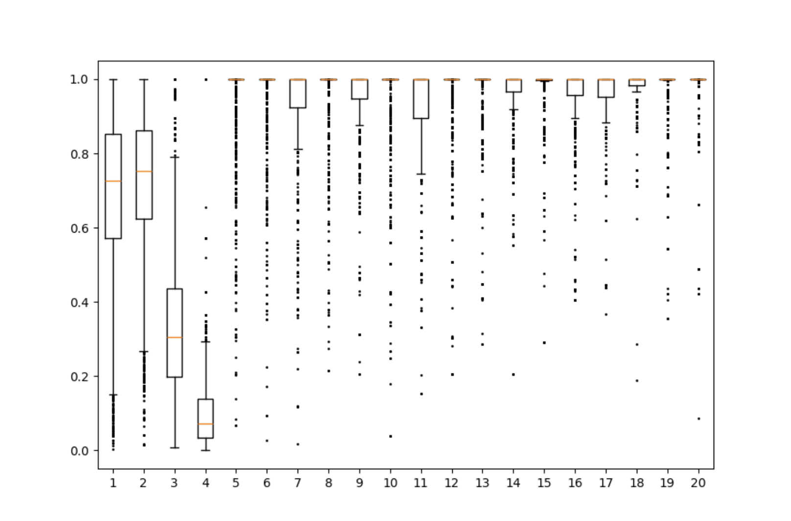
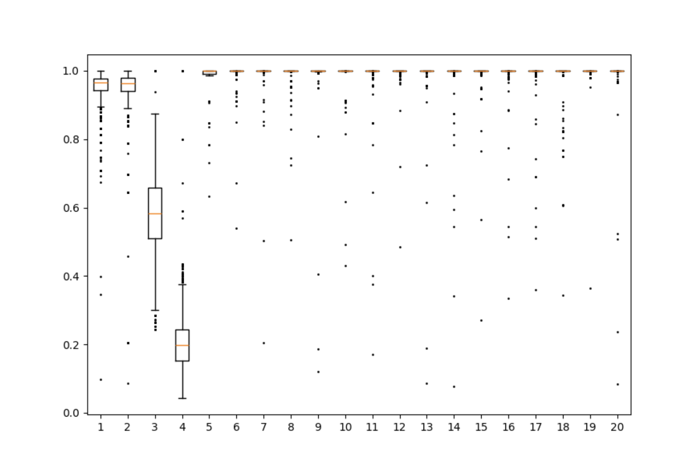

# RFF-for-GP  

## About The Project  
A Python implementation of Gaussian Processes (GP) with Random Fourier Features (RFF) for scalable approximation.  

## Features  
- Implements Gaussian Process (GP) regression.  
- Uses Random Fourier Features (RFF) for computational efficiency.  
- Supports different kernel functions.

## Installation  
Ensure **Python 3.7+** is installed with the required packages:  
```bash
pip install numpy scipy scikit-learn matplotlib
```

## Usage
To test the variable selection method with the RFF kernel, run `GP_test(2).py`.  
Ensure that this file is in the same folder as `GP_no_scheme.py`.  
No modifications to the files are needed to run the simulations. 
This will generate:
- a printed Mean Error value
- runtime in seconds
- boxplots illustration of the association of individual covariates (x’s) with the response

## Testing Walkthrough 
The `GP_test(2).py` script follows these steps:
- import the required libraries
  ```
  import numpy as np
  import GP_no_scheme as gp
  import matplotlib.pyplot as plt
  ```
  
- set random seed `np.random.seed(42)` to make the results reproducible
- define the response function:
  ```
  def func(x: np.ndarray, eps=0):
  return x[:, 0] + x[:, 1] + np.sin(3 * x[:, 2]) + np.sin(5 * x[:, 3]) + eps
  ```
  - `eps` is normally distributed noise term.
  - The function corresponds to equation (6.2) from the referenced paper for results comparison, but you can modify it as needed.
- Setting Simulation Parameters:
  ```
  n = 100     
  p = 20      
  n_f = 100   
  ```
  parametrization, same as in the simulation studies we have replicated, where:
   - `n`: size of training data set
   - `p`: input vector length
 
-  Generating Training and Test Data
  ```
    x = np.random.uniform(size=(n, p))  
    eps = np.random.normal(scale=0.05, size=n)  
    x_f = np.random.uniform(size=(n_f, p))
    y = func(x, eps)
    y_f = func(x_f)
  ```
- Initializing the Gaussian Process Model
> **Note:** With the current code structure, only one model can be run at a time.  
> The primary focus is on the GP with RFF, but the GP model without RFF (GPM3)  
> can be run separately for comparison.
- #### GP with RFF
    ```
    model = gp.GPM_rand_features(x, y, 0.25, 2, 0.1, 500, 100)
    ```
    - `gp.GPM_rand_features` initializes a GP model using Random Fourier Features (RFF).
- #### GP model without RFF
    ```
    model = gp.GPM3(x, y, 0.25, 2, 0.1, 500)
    ```
    
-  Running MCMC Sampling
     ```
     models = model.mcmc_iterate_verbose(5_000, 100)
     print(models[-1].alpha) # Extracting Model Parameters
     ```
     Runs 5,000 iterations, with updates printed every 100 steps.
   
- Extracting and Evaluating Model Performance
    ```
    all_ros = np.row_stack([m.ro[:20] for m in models])
    likelihoods = [m.saved_log_likelihood for m in models]
    best = models[np.argmax(likelihoods)]
    y_predict = best.predict(x_f)
    print(f"Mean error = {np.sqrt(np.mean(np.square(y_predict - y_f)))}")
    ```
    obtain mean error from here

- Visualizing Model Results
    ```
    plt.figure(dpi=100)
    plt.figure(figsize=(9, 6))  # Set figure size for the box plot
    plt.boxplot(all_ros, flierprops={'marker': 'o', 'markersize': 1})
    plt.show()
    ```
    The above plot visualizes surface response to the input data set of x's.
    The further away a boxplot is from "1" along the y-axis, the stronger the response.
    We infer that the  covariates were selected fif they are clearly separated from "1"
### Expected Results:

#### GP with RFF
**Mean Error:**  
- Mean error = 0.055775034318735026  

**Run Time:**  
- T ≈ 40 s  

**Variable Selection Results:**  
- Correctly identifies 4 / 4 covariates (corresponding to x₁, x₂, x₃, x₄)  



---

#### GP without RFF
**Mean Error:**  
- Mean error = 0.0273706032954638  

**Run Time:**  
- T ≈ 45 s  

**Variable Selection Results:**  
- Correctly identifies 4 / 4 covariates (corresponding to x₁, x₂, x₃, x₄)
  

     
## Performance Metrics
- #### GP with RFF
  - F1_score=0.99
- #### GP without RFF
  - F1_score=0.9901
